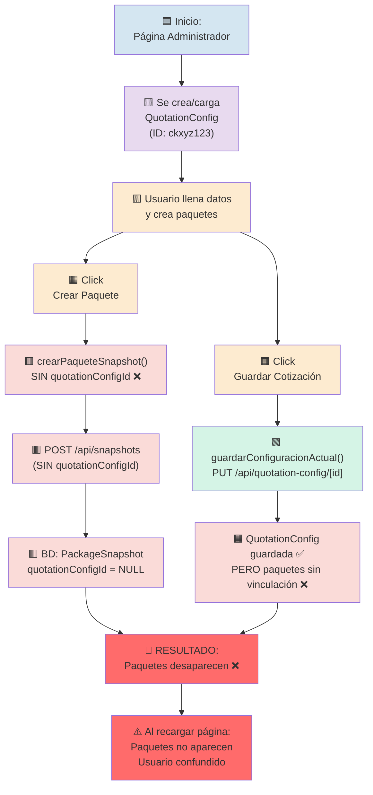
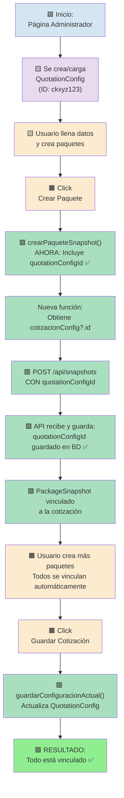
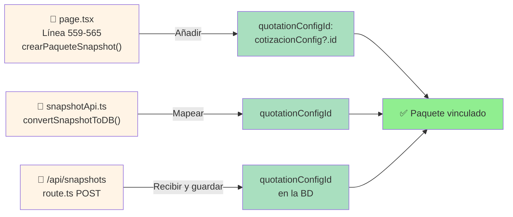
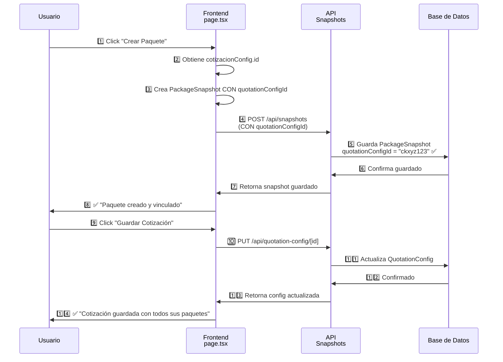

# Flujo de Creación de Cotizaciones

## 🔴 PROBLEMA ACTUAL (ROTO)

---

## ✅ SOLUCIÓN: OPCIÓN 1 - Auto-Link on Create (RECOMENDADA)

---

## 📊 Cambios de Código Necesarios (Opción 1)

---

## 🔄 Flujo Completo Paso a Paso (Solución)

---

## 📋 Checklist de Implementación

- [ ] **Paso 1:** Modificar `crearPaqueteSnapshot()` en page.tsx
  - [ ] Obtener `cotizacionConfig?.id`
  - [ ] Incluir `quotationConfigId` en el snapshot
  
- [ ] **Paso 2:** Actualizar `convertSnapshotToDB()` en snapshotApi.ts
  - [ ] Mapear `quotationConfigId` del snapshot
  
- [ ] **Paso 3:** Modificar `/api/snapshots` POST
  - [ ] Recibir `quotationConfigId` en datos
  - [ ] Guardar `quotationConfigId` en la BD
  
- [ ] **Paso 4:** Pruebas
  - [ ] Crear paquete y verificar BD
  - [ ] Guardar cotización
  - [ ] Recargar página y verificar que los paquetes aparecen

---

## 🎯 Ventajas de Esta Solución

✅ **Paquetes se guardan inmediatamente** - No se pierden datos  
✅ **UX responsivo** - Retroalimentación inmediata al usuario  
✅ **Simple de implementar** - Solo 3 cambios de código  
✅ **Comportamiento lógico** - Los paquetes se vinculan a la cotización que se está editando  
✅ **Menos riesgo** - No requiere refactor mayor del flujo  
